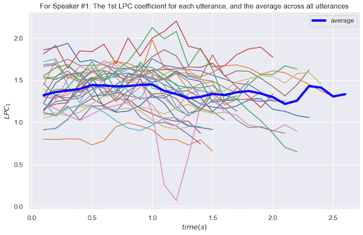
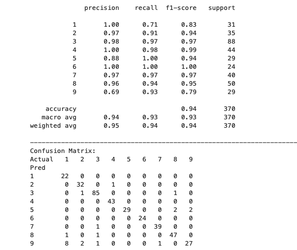

# Classification of Speech Signals 
> Using dynamic time warping (DTW) on multidimensional **time-series data**

## Overview
This goal of this educational project was to uniquely identify each person who uttered two Japanese vowels _/ae/_ multiple times. This time-series dataset was collected by Mineichi Kudo, Jun Toyama, and Masaru Shimbo from Hokkaido University, as described in their paper titled "Multidimensional curve classification using passing-through regions". I chose an algorithm uniquely different from their analysis, namely dynamic time warping (DTW), and it proved well-suited for this classification task, achieving an accuracy of 94%.

## Data Understanding
The dataset contains multiple utterances of two Japanese vowels _/ae/_ by nine male speakers. Each utterance is of varying duration (0.7s-2.9s), with each point in time described by 12 features (ie, 12 LPC cepstrum coefficients). This results in a multidimensional time-series with a duration that varies from speaker to speaker.

There are 640 time-series in total, broken down as follows:
- Training: 270 (30 utterances for each of 9 speakers). File: `ae.train`
- Testing: 370 (24-88 unique utterances by the same 9 speakers). File: `ae.test`

Within each file:
- Columns: 12 LPC coefficients in increasing order, separated by spaces
- Rows: Are organized into `blocks`that each represent a single utterance of _/ae/_; `blocks` consist of 7-29 rows. Blocks are separated by blank lines. Sets of consecutive blocks correspond to each speaker. For excample, in the training set, blocks 1-30 represent speaker 1, blocks 31-60 represent speaker 2, and so on. For the training set, each speaker has the same number of blocks, namely 30 (ie, 30 utterances). In the testing set, speakers 1-9 have the following number of blocks, respectively: 31 35 88 44 29 24 40 50 29
- Therefore, columns capture frequency and rows respresent time. 

The following is a plot of the 1st LPC coefficient from every utterance by speaker 1 in the training set, as well as the average:

## Modeling and Evaluation
The general idea is to compare the utterances from each speaker in the training set to those in the testing set using a distance metric. The Dynamic Time Warping (DTW) algorithm was chosen, namely `fastdtw` from conda-forge. To simplify the analysis, all utterances per speaker in the training set were averaged across the same point in time, leaving a single, average utterance for each speaker. This average utterance was then compared to each utterance in the testing set by calculating the DTW distances between the twelve corresponding LPC coefficient time-series. After summing up all the DTW distances for the twelve LPC coefficients per utterance, the minimum of these was chosen, and the corresponding speaker was thereby used to classify the given utterance. Speakers 5 and 6 were the easiest to distinguish, both achieving perfect recall. Speaker 1 was the most challenging with a recall of only 71%. Overall, an accuracy (or recall in this case) of 94% was achieved.

## Conclusion
Dynamic Time Warping worked well to distinguish nine male speakers by their utterances of two Japanese vowels _/ae/_, achieving about 94% accuracy overall. (As mentioned in the paper by Kudo, Toyama, and Shimbo, they achieved a 94.1% recognition rate.) 

If my modeling technique was slightly altered, I may be able to improve performance. More specifically, instead of averaging all utterances for each speaker in the training dataset, the 30 utterances per speaker could be individually compared to every utterance in the testing dataset, and, with a minimum distance found via DTW, a **majority vote** would instead determine the match.